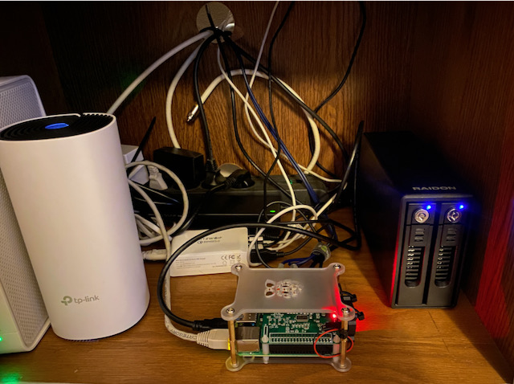

# Raspberry PI Configuration

My Raspberry Pi installation at home.

* Do not touch anything by hand, use Ansible.
* If something is hard to automate, document it at least.

## Hardware

* Raspberry Pi 4 model B, 4GB
* HiFiBerry DAC+
* RAIDON GR3660-B3 (it's noisy)



## Manual setup

### Install image

The repository is tested against Raspberry Pi OS Lite 32 bit (Debian 11 "Bullseye").

1. Install image on SD card
1. Append `ip=«IP»` into `cmdline.txt`
1. Enable ssh `touch ssh`

### Configuring SSH

Generate key:

```
ssh-keygen -f pi_rsa
```

Configure client:

```
cat <<EOT >> ~/.ssh/config
Host pi
	HostName «IP»
	User pi
	IdentityFile ~/.ssh/pi_rsa
EOT
```

Copy key to Raspberry Pi:

```
ssh-copy-id -i ~/.ssh/pi_rsa.pub pi
```

### GCP Cloud Logging

Create service account with roles: `roles/logging.logWriter` and `roles/monitoring.metricWriter`, 
see [GCP Cloud Logging documentation](https://cloud.google.com/logging/docs/agent/logging/authorization) for more details.

## Ansible playbooks

Install 3rd party roles:

```
ansible-galaxy install -r requirements.yml
```

### Packages playbook

Configure APT repositories, install packages and upgrade system to backported Buster:

```
ansible-playbook packages.yml
```

### Pimp my Pi playbooks

Various playbooks to improve vanilla Raspberry Pi setup:

```
ansible-playbook pimpmypi.yml
```

Roles:

* common - missing pieces of vanilla Raspberry distribution
* fluentbit - send systemd logs to [GCP Logging](https://cloud.google.com/logging) 
  and/or [Loki](https://grafana.com/oss/loki/)
* grafana - monitoring with [Grafana Cloud](https://grafana.com/products/cloud/) (free tier)
* hdidle - spin-down disks, see [Github](https://github.com/adelolmo/hd-idle)
* log2ram - move logs into RAM, see [Github](https://github.com/azlux/log2ram)
* posfix - forward mails to real account
* smartmontools - monitor hard drives

### Other playbooks

* adguard - privacy all the time, see [AdGuard Home](https://adguard.com/en/adguard-home/overview.html)
* backup - to backup or not to backup, that’s no question, see [Backup Ninja](https://0xacab.org/liberate/backupninja)
* kodi - the best smart tv ever, [Wiki](https://kodi.wiki/view/Main_Page)
* raspotify, shairport - make my retired HiFi great again: [Raspotify](https://github.com/dtcooper/raspotify), [Librespot](https://github.com/librespot-org/librespot), [Shairport](https://github.com/mikebrady/shairport-sync)
* samba - my family disk for files and automated backups, see [Samba](https://www.samba.org)
* transmission - the lightest BT daemon, see [Transmission](https://transmissionbt.com)

